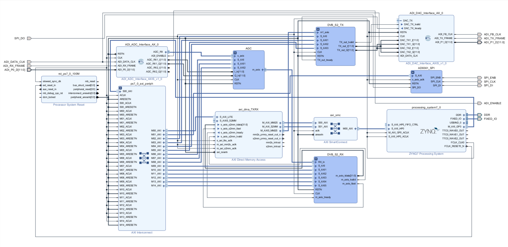
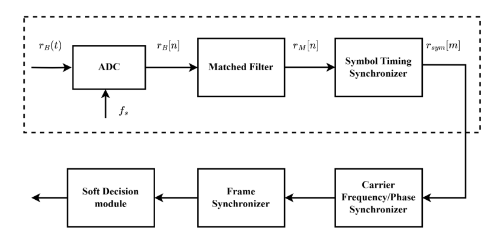
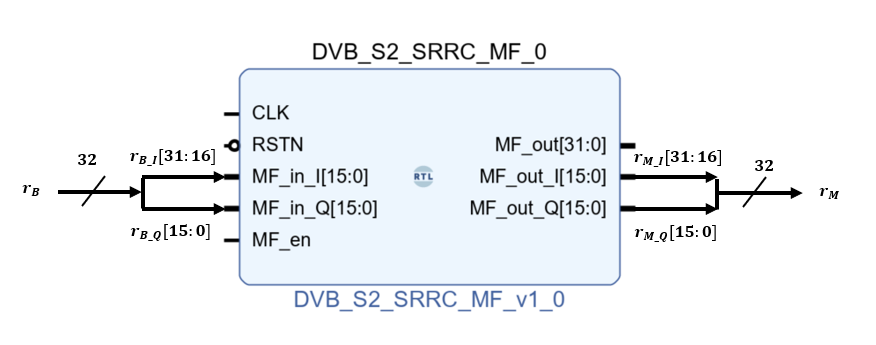
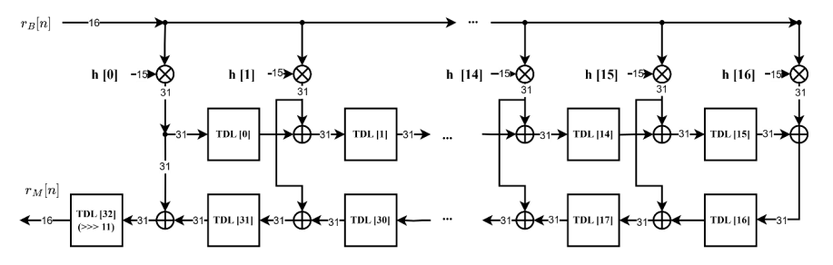
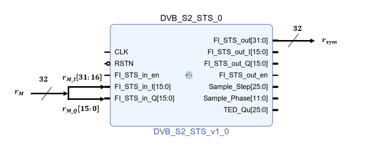
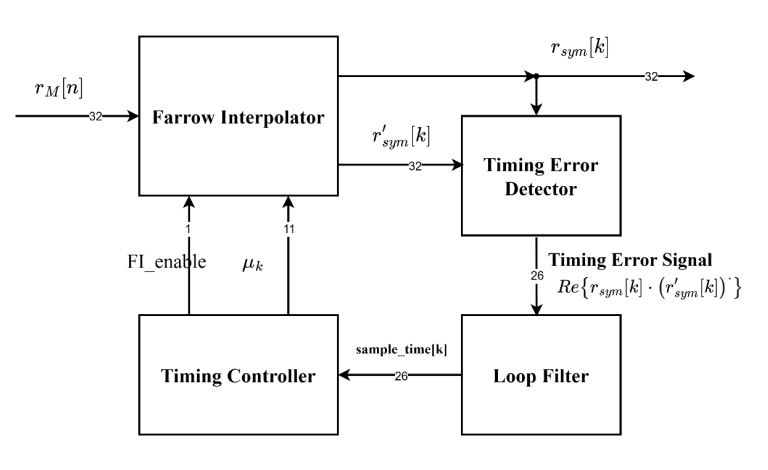
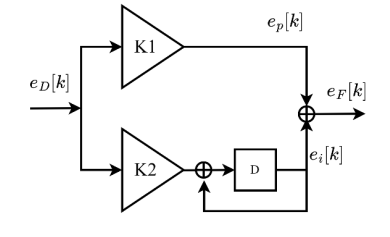
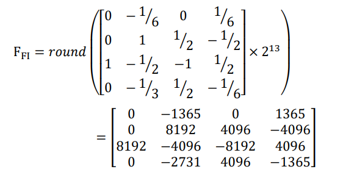
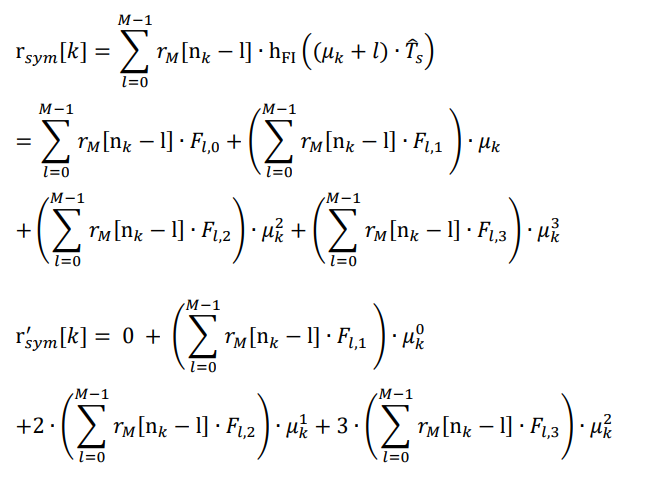

# DVB-S2 Hardware

平台: Xilinx ZedBoard+AD9361 Zynq-7000 SoC

#### Block design:

# RX Inner Receiver
實現模組: Matched Filter and Symbol Timing Synchronizer

## Matched Filter 
#### Interface:

#### Architecture:

SRRC 匹配濾波器輸入訊號為r_B[n] 32 位元，分為實部(或同相 in-phase, I)和虛部(正交相 quadrature, Q)訊號各 16 位元，所以匹配濾波器會分成 I和 Q 路做運算。I 路為r_B[𝑛]的最高位元(most significant bit, MSB)的前16 位元的位置(硬體語言中以 r_B[31:16] 表示為取 r_B 訊號從左側開始數的 16 個位置)，Q 路為r_B[𝑛]的最低位元(least significant bit, LSB) 的 16 位元的位置(硬體語言中以 r_B[15:0] 表示為取 r_B 訊號從右側開始數的 16 個位置)。SRRC 係數設計為 15 位元，相乘後的值設計為 31 位元，最後一級輸出值由 31 位元量化為 16 位元之r_M[𝑛]的I、Q 訊號。

## Symbol Timing Synchronizer
#### Interface:

#### Architecture:
匹配濾波器輸出端加上時間錯誤檢測器(Timing error detector, TED)，利用匹配濾波器的輸出和本地參考訊號之間估計出一個時間偏移值，此偏移值接著輸入到迴路濾波器(Loop filter)得到對取樣時間和步伐微調的值，並透過 Farrow內插器(Interpolator)重新取樣得到最佳觀測點，達到符碼同步之目標，架構如下圖。

### Gardner Timing Error Detector (Gardner TED)
使用Gardner 提出的演算法，利用接收到的樣本估計時間相位偏差。
原理是由於理想符碼時間相位是在眼圖開最大位置，即其功率最大位置，從計算連續時間符碼區間內的平均功率$J(\tau)$作為觀察，將其微分後即為零點，即是理想符碼時間相位，用來判斷當下的時間相位相對於理想時間相位是提前(Early)或是落後(Late)。
而對$J(\tau)$做微分之公式，實際上簡化後，即為重新取樣的觀測值和它的微分值取共軛複數，做相乘後取實部。

$J(\tau)=\frac{1}{N}*\sum_{k=0}^{N-1}\mid r_M(k\cdot T_{sym}+\tau)\mid^2$

$e_D[k]=\frac{dJ(\tau)}{d\tau}=Re\{r_M(k\cdot T_{sym}+\tau)\cdot (\frac{dr_M(k\cdot T_{sym}+\tau)}{d\Delta\tau})^*\}=Re\{r_{sym}[k]\}\cdot Re\{r_{sym}^[k]\}+Im\{r_{sym}[k]\}\cdot Im\{r_{sym}^[k]\}$

### Loop Filter
迴路濾波器(Loop filter)的輸入即是時間誤差訊號，目的是用來穩定時間相位的校正率，使內插器達到最佳取樣。
用接收到離散的觀測值$𝑒_𝐷[𝑘]$，透過迴路濾波器做動態調整時間相位，當參數調整適當時即會鎖定時間相位。

迴路濾波器有兩個重要的參數 K1 和 K2。K1 功能為追蹤時間相位誤差，根據時間相位誤差的大小調整其相位。K2 為追蹤頻率誤差。

$e_p[k]=K1\times e_D[k]$

$e_i[0]=4$

$e_i[k]=e-i[k-1]+K2\times e_D[k]$

$e_F[k]=e_i[k]+e_p[k]$

簡單來說，當$𝑒_𝐷[𝑘] > 0$為時間相位提前(Early)，$e_F[𝑘]$就會加大步伐，而當$𝑒_𝐷[𝑘] < 0$為時間相位落後(Late)，$e_F[𝑘]$就會減小步伐。

#### Architecture:

### Farrow Interpolator
Farrow 內插器是一種將訊號和脈衝響應做 convolution 的有限脈衝響應(Finite Impulse Response, FIR)濾波器。其係數，硬體設計使用 13 位元的固定點數。

推導完之Farrow內插器模型，而根據 Gardner 演算法還需要內插器的微分值模型如下:

### Interpolation Controller
內插控制器負責告知內插器取樣的時間點($T_{𝑠𝑦𝑚}[𝑘]$)，其取樣時間點$T_{𝑠𝑦𝑚}[𝑘]$由迴路濾波器的輸出$e_F[𝑘]$調整。取樣時間點$T_{𝑠𝑦𝑚}$初始值為零，當時間 k 數到 4 的倍數會加上$e_F[𝑘]$調整，並告知內插器取樣。

$T_{𝑠𝑦𝑚}[0]=0$

$T_{𝑠𝑦𝑚}[𝑘]=T_{𝑠𝑦𝑚}[𝑘-1]+e_F[k]$

